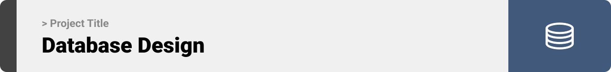
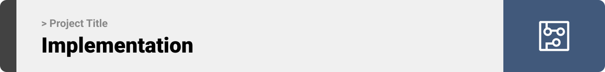

<br><br>

<!-- project philosophy -->


> At the heart of Med-Hub, our mission is to streamline and enhance the healthcare experience by fostering a seamless connection between doctors, patients, and insurance companies. We believe that everyone deserves access to efficient, transparent, and comprehensive healthcare services. Our website is designed to be the bridge that links these critical components of the healthcare ecosystem.

### User Stories
- Patients Story:

As a patient I can easily view my medical profile and the last investigations by doctors,diagnosis,medicines details, by dates. situation. 
As a patient  I will have a full and clear knowledge about my health.
As a patient  I will chat easily with doctor and wait a reply from him.

- Doctors Story:

As a doctor, I can create a patients profile easily.
As a doctor add to the file all the needed medical records, diagnosis, prescriptions, and insurance approval form.
As a doctor, I can reply to patients messages in live chat.


- Insurance company:

As an insurance company, I will control the request through AI
As an insurance company I can give acceptance and rejection according to it for all the 3 parties, so i can control any cheating from any party.
As an insurance company, I will notify the patients and the doctors about the request result.
<br><br>
<!-- Tech stack -->


###  Med-Hub is built using the following technologies:

- This project uses the [React Js Library](https://react.dev/). React is a JavaScript-based UI development library.React lets you build user interfaces out of individual pieces called components. Create your own React components like Thumbnail, LikeButton, and Video. Then combine them into entire screens, pages, and apps.

- For persistent storage (database), the website uses the [MySQL](https://mysql.com/) MySQL is an open-source Relational Database Management System (RDBMS) that enables users to store, manage, and retrieve structured data efficiently. It is widely used for various applications, from small-scale projects to large-scale websites and enterprise-level solutions.

- To send live chat, the websites uses the [firebase](https://pub.dev/packages/flutter_local_notifications) package which supports Android, iOS, and macOS.
  - 🚨 Currently, notifications aren't working on macOS. This is a known issue that we are working to resolve!

<br><br>
<!-- UI UX -->


> We designed Med-hub using wireframes and mockups, iterating on the design until we reached the ideal layout for easy navigation and a seamless user experience.

- Project Figma design [figma](https://www.figma.com/file/eBXHo0GFfrPXioimSVDsOu/Final-Project?type=design&node-id=45%3A1115&mode=design&t=girWj415tgaPpad2-1)


### Mockups
| Home screen  | Doctor Page 1 | Doctor Page 2 | Doctor Page 2 |Patient Page |Insurance Page |Admin Page 2 |Admin Page 2 |
|  |  |  | | | |

<br><br>

<!-- Database Design -->


| ER Diagram  |
|  |

<br><br>


<!-- Implementation -->



### Websites Screens (Web)

|  |  |  ||  |  | | |

### Admin Screens (Web)

|  |
<br><br>


<!-- Prompt Engineering -->


###  Mastering AI Interaction: Unveiling the Power of Prompt Engineering:

- This project uses advanced prompt engineering techniques to optimize the interaction with natural language processing models. By skillfully crafting input instructions, we tailor the behavior of the models to achieve precise and efficient language understanding and generation for various tasks and preferences.

- After understanding the AI's capabilities, I created this prompt to elicit the most accurate and useful responses. The AI will validate the lab results  and symptoms against the prescriptions and diagnosis to help the insurance company decide whether to accept or reject the request.


|  |
<br><br>

<!-- AWS Deployment -->


###  Efficient AI Deployment: Unleashing the Potential with AWS Integration:

- This project leverages AWS deployment strategies to seamlessly integrate and deploy natural language processing models. With a focus on scalability, reliability, and performance, we ensure that AI applications powered by these models deliver robust and responsive solutions for diverse use cases.

* Deployment of Laravel server using Amazon Web Services (AWS) Elastic Compute Cloud (EC2). AWS EC2 provides scalable and flexible virtual servers in the cloud.

* Utilizing EC2 for deploying applications offers several advantages, including the ability to easily scale resources based on demand, and benefit from AWS's global infrastructure for improved performance and reliability.

* EC2 instances are configurable, allowing users to choose the instance type, operating system, and storage options that best suit their application requirements. This flexibility and scalability make AWS EC2 a popular choice for hosting and running diverse workloads, including web servers, applications, and databases.

* To host the server , the following steps were taken:
   
   1. Connect to the EC2 instance using SSH.
   2. Clone the server repository from GitHub.
   3. Install the required dependencies and libraries using sudo apt-get install.
   
|  |
   4. To run the server:
      * sudo service apache2 start.


<br><br>

<!-- Unit Testing -->


###  Precision in Development: Harnessing the Power of Unit Testing:

- This project employs rigorous unit testing methodologies to ensure the reliability and accuracy of code components. By systematically evaluating individual units of the software, we guarantee a robust foundation, identifying and addressing potential issues early in the development process.

- Common Password Unit Test: Is to prevent the user from creating  a  password is to common and very usabale.

| 

- User cannot login more than 5 times within a minute test, this test ensures that the user cannot have 5 unsuccessful logins in a min.
| 

- Successful login test resets the login attempt , where the successfull login will remove the unsuccessful  attempts.
| 

- Successful login test to assure a user successful login.
| 

<br><br>


<!-- How to run -->


> To set up Med-Hub locally, follow these steps:

### Prerequisites

This is an example of how to list things you need to use the software and how to install them.

* Install Node.js on your computer.

* Install PHP on your computer.


### Installation

_Below is an example of how you can instruct your audience on installing and setting up your app. This template doesn't rely on any external dependencies or services._

1. Get a free API Key at [openai.com](https://platform.openai.com/account/api-keys)
2. Clone the repo
   git clone [github](https://github.com/Mohamad685/med-hub.git)
3. Install NPM packages in the frontend file.
   ```sh
   npm install
   ```
4. Install Composer in the server.
   ```sh
   composer install
   ```
4. Create a .env file and add:
   ```js
   const VITE_OPENAI_API_KEY = 'ENTER YOUR API';


Now, you should be able to run Med-Hub locally and explore its features.